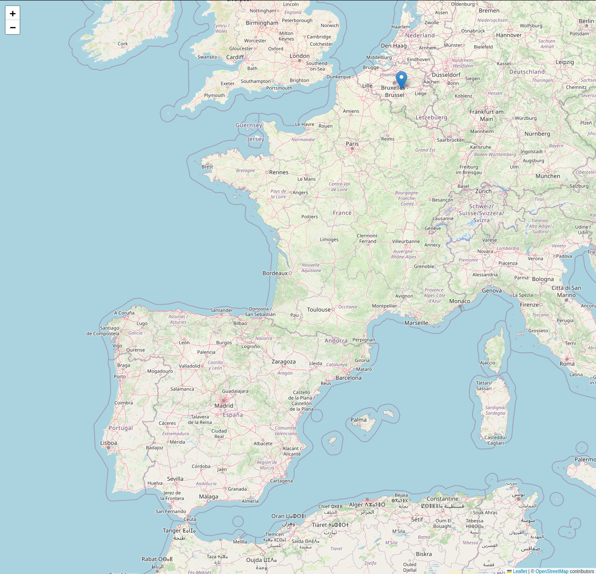

# Phone Geolocation

Se trata de un script que ofrece la posibilidad de dar una localización apróximada a través de un número de teléfono otorgado por el usuario.
## Instalación

Para poder ejecutar correctamente el script se requiere instalar algunos paquetes externos de Python, todas las referencias se ubican en el archivo **requirements.txt**.

Instalar Python en caso de que no lo tenga:

[Download Python](https://www.python.org/downloads/)

Instalación de paquetes externos:

```bash
  pip install phonenumbers folium geopy
```


## Funcionalidades

- **Información acerca del número telefónico proporcionado**: Tras ejecutar el script, nos otorga información relevante como el país de origen, el operador asociado a ese número de teléfono y la zona horaria correspondiente a ese país. Esta información es obtenida gracias al uso del paquete externo **phonenumbers**.

- **Uso de folium**: Gracias al uso del paquete externo folium el script es capaz de generar un mapamundi donde marca de forma clara donde se ubica de manera aproximada el número de teléfono proporcionado.

- **Almacenamiento del mapa**: El mapa generado por folium por defecto se almacena en el misma ruta donde resida el script. Se almacena en formato HTML, por lo que solo basta abrirlo a través del navegador web para poder visualizarlo.


## Ejemplo de uso

A continuación se muestra un ejemplo de como se ve el script al ejecutarlo. Toda la información relevante ha sido borrada, es más para mostrar como se vería por pantalla la información tras lanzar el script.

```bash
$ python phone_geolocation.py

Dime el país donde creas que pertenece el sufijo: SUFIJO_PAIS
Numero : NUMERO
Pais : PAIS
Operador : OPERADOR
Zona horaria : ZONA_HORARIA
Mapa guardado en: phone_map.html
```


## Screenshots

Así se vería el mapa si por ejemplo abrimos en el navegador el fichero .html obtenido tras lanzar el script.




## Desarrollo

El script presentado se encuentra desarrollado en **Python**.


## Disclaimer

El script fue creado únicamente por motivos educativos, principalmente para aprender a realizar scripts o programas desarrollados en Python que involucren conceptos o casos prácticos a la Ciberseguridad o al Hacking Ético.

Se ruega utilizar los programas añadidos a este repositorios para dicho fin sobre equipos aislados o virtuales para simular el entorno, en caso contrario, no nos hacemos responsables de su uso fuera de ese ámbito.

